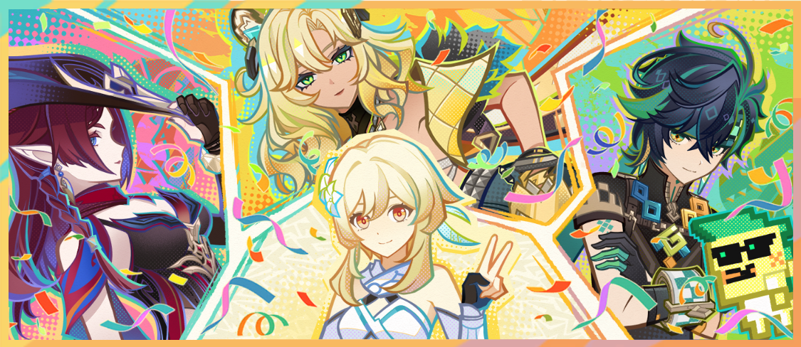

# 「砥砺之证」

**协助话事处的战备联络人伊拉德认证考核关卡后获得的纪念品，绘有你与伙伴们的肖像。  
据伊拉德所说，此次由三位大师参与设计，你亲自予以认证的考核关卡，或许是无需迭代的最佳版本，将成为部族战士们挑战自我，锤炼技艺的第一选择…**

不论环境如何变化，心中的斗志都该恒常燃烧，磨砺武艺的步伐也不应放缓。  
遵照惯例，以「纳茨卡延」的「巴莱卡」希诺宁、「维茨特兰」的「马力ト」基尼奇和「特拉洛坎」的「武卡」恰斯卡三位大师为主，三部族的著名强者一同设计了全新的砥砺目标，为我们指明了锤炼自我的方向。同时，殊为可敬的「杜麦尼」为这些挑战予以了最高的认证！  
战士们！榜样在前，拿出气势，不断冲击地平线上的新记录吧！
